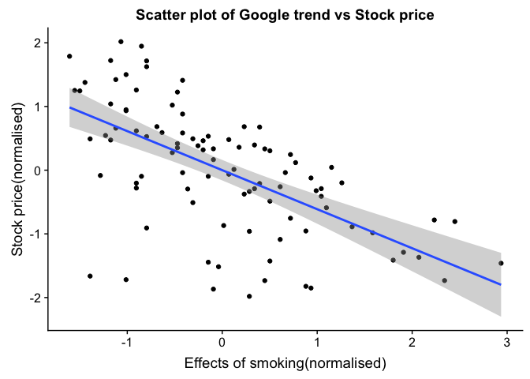

R Notebook
================

Big Data Analysis
=================

In this project, we try to explore the relationship between British-American Tobacco's stock prices and google trends.
----------------------------------------------------------------------------------------------------------------------

We will be using 3 keywords to explore the relationship. i.e.
-------------------------------------------------------------

### 1. Quit Smoking

### 2. Effects of smoking

### 3. Electronic cigarette

    ## 
    ## Attaching package: 'dplyr'

    ## The following objects are masked from 'package:stats':
    ## 
    ##     filter, lag

    ## The following objects are masked from 'package:base':
    ## 
    ##     intersect, setdiff, setequal, union

    ## 
    ## Attaching package: 'reshape2'

    ## The following object is masked from 'package:tidyr':
    ## 
    ##     smiths

    ## 
    ## Attaching package: 'lubridate'

    ## The following object is masked from 'package:base':
    ## 
    ##     date

    ## 
    ## Attaching package: 'gridExtra'

    ## The following object is masked from 'package:dplyr':
    ## 
    ##     combine

    ## 
    ## Attaching package: 'GGally'

    ## The following object is masked from 'package:dplyr':
    ## 
    ##     nasa

    ## 
    ## Attaching package: 'cowplot'

    ## The following object is masked from 'package:ggplot2':
    ## 
    ##     ggsave

    ## 
    ## Attaching package: 'plotly'

    ## The following object is masked from 'package:ggplot2':
    ## 
    ##     last_plot

    ## The following object is masked from 'package:stats':
    ## 
    ##     filter

    ## The following object is masked from 'package:graphics':
    ## 
    ##     layout

    ## corrplot 0.84 loaded

    ## Loading required package: lattice

Summary of all Data
===================

    ##    year_month electroniccigarette effectsofsmoking  quitsmoking    
    ##  2010-01: 1   Min.   :  4.00      Min.   : 16.00   Min.   : 22.00  
    ##  2010-02: 1   1st Qu.: 16.75      1st Qu.: 30.75   1st Qu.: 31.00  
    ##  2010-03: 1   Median : 40.50      Median : 43.50   Median : 36.00  
    ##  2010-04: 1   Mean   : 42.57      Mean   : 45.72   Mean   : 39.42  
    ##  2010-05: 1   3rd Qu.: 73.50      3rd Qu.: 57.00   3rd Qu.: 42.25  
    ##  2010-06: 1   Max.   :100.00      Max.   :100.00   Max.   :100.00  
    ##  (Other):90                                                        
    ##   stock_price         date           
    ##  Min.   :22.04   Min.   :2010-01-01  
    ##  1st Qu.:36.49   1st Qu.:2011-12-24  
    ##  Median :45.86   Median :2013-12-16  
    ##  Mean   :45.53   Mean   :2013-12-15  
    ##  3rd Qu.:52.61   3rd Qu.:2015-12-08  
    ##  Max.   :69.46   Max.   :2017-12-01  
    ## 

Data distribution
=================

We use density plots to observe the data distribution
-----------------------------------------------------

    ## `stat_bin()` using `bins = 30`. Pick better value with `binwidth`.
    ## `stat_bin()` using `bins = 30`. Pick better value with `binwidth`.
    ## `stat_bin()` using `bins = 30`. Pick better value with `binwidth`.
    ## `stat_bin()` using `bins = 30`. Pick better value with `binwidth`.

Plotting monthly values of Stock price against google trends
============================================================

Normality test for stock prices
===============================

    ## 
    ##  Shapiro-Wilk normality test
    ## 
    ## data:  allData$stock_price_std
    ## W = 0.97656, p-value = 0.08287

Observing co-relation
=====================

Since data-distributions do not seem to be normal, we will use kendall's co-relation test
-----------------------------------------------------------------------------------------

1. Effects of smoking
---------------------

### Normality test

    ## 
    ##  Shapiro-Wilk normality test
    ## 
    ## data:  allData$effectsofsmoking_std
    ## W = 0.96115, p-value = 0.006129

    ## 
    ##  Kendall's rank correlation tau
    ## 
    ## data:  allData$effectsofsmoking and allData$stock_price_std
    ## z = -6.8774, p-value = 6.096e-12
    ## alternative hypothesis: true tau is not equal to 0
    ## sample estimates:
    ##        tau 
    ## -0.4793742

    ## 
    ## Call:
    ## lm(formula = effectsofsmoking_std ~ stock_price_std, data = allData)
    ## 
    ## Residuals:
    ##      Min       1Q   Median       3Q      Max 
    ## -2.41058 -0.51309 -0.00223  0.48365  2.04060 
    ## 
    ## Coefficients:
    ##                   Estimate Std. Error t value Pr(>|t|)    
    ## (Intercept)     -6.433e-17  8.107e-02    0.00        1    
    ## stock_price_std -6.129e-01  8.150e-02   -7.52  3.2e-11 ***
    ## ---
    ## Signif. codes:  0 '***' 0.001 '**' 0.01 '*' 0.05 '.' 0.1 ' ' 1
    ## 
    ## Residual standard error: 0.7944 on 94 degrees of freedom
    ## Multiple R-squared:  0.3756, Adjusted R-squared:  0.369 
    ## F-statistic: 56.55 on 1 and 94 DF,  p-value: 3.204e-11

2. Quit smoking
---------------

### Normality test

    ## 
    ##  Shapiro-Wilk normality test
    ## 
    ## data:  allData$quitsmoking_std
    ## W = 0.8207, p-value = 1.936e-09

    ## 
    ##  Kendall's rank correlation tau
    ## 
    ## data:  allData$quitsmoking_std and allData$stock_price_std
    ## z = -4.4271, p-value = 9.549e-06
    ## alternative hypothesis: true tau is not equal to 0
    ## sample estimates:
    ##        tau 
    ## -0.3109978

    ## 
    ## Call:
    ## lm(formula = quitsmoking_std ~ stock_price_std, data = allData)
    ## 
    ## Residuals:
    ##     Min      1Q  Median      3Q     Max 
    ## -2.0449 -0.4152 -0.1152  0.2499  3.9829 
    ## 
    ## Coefficients:
    ##                   Estimate Std. Error t value Pr(>|t|)    
    ## (Intercept)      1.579e-17  9.512e-02   0.000 1.000000    
    ## stock_price_std -3.749e-01  9.562e-02  -3.921 0.000167 ***
    ## ---
    ## Signif. codes:  0 '***' 0.001 '**' 0.01 '*' 0.05 '.' 0.1 ' ' 1
    ## 
    ## Residual standard error: 0.932 on 94 degrees of freedom
    ## Multiple R-squared:  0.1406, Adjusted R-squared:  0.1314 
    ## F-statistic: 15.38 on 1 and 94 DF,  p-value: 0.0001673

3. Electronic-Cigarrette
------------------------

### Normality test

    ## 
    ##  Shapiro-Wilk normality test
    ## 
    ## data:  allData$electroniccigarette_std
    ## W = 0.91538, p-value = 1.182e-05

    ## 
    ##  Kendall's rank correlation tau
    ## 
    ## data:  allData$electroniccigarette_std and allData$stock_price_std
    ## z = 11.993, p-value < 2.2e-16
    ## alternative hypothesis: true tau is not equal to 0
    ## sample estimates:
    ##       tau 
    ## 0.8375843

    ## 
    ## Call:
    ## lm(formula = electroniccigarette_std ~ stock_price_std, data = allData)
    ## 
    ## Residuals:
    ##      Min       1Q   Median       3Q      Max 
    ## -0.69926 -0.28142 -0.04447  0.27044  1.12212 
    ## 
    ## Coefficients:
    ##                  Estimate Std. Error t value Pr(>|t|)    
    ## (Intercept)     1.765e-16  3.770e-02    0.00        1    
    ## stock_price_std 9.301e-01  3.790e-02   24.54   <2e-16 ***
    ## ---
    ## Signif. codes:  0 '***' 0.001 '**' 0.01 '*' 0.05 '.' 0.1 ' ' 1
    ## 
    ## Residual standard error: 0.3694 on 94 degrees of freedom
    ## Multiple R-squared:  0.865,  Adjusted R-squared:  0.8636 
    ## F-statistic: 602.3 on 1 and 94 DF,  p-value: < 2.2e-16

Dividing data into training and test set
========================================

We will use 90% of the data as train, and 10% as test
-----------------------------------------------------

Using Auto-Arima on training set (without regressors)
=====================================================

Evaluating on test set
======================

    ##       RMSE   Rsquared        MAE 
    ## 0.34668974 0.08397744 0.25617784

Using Auto-Arima on training set (with regressors)
==================================================

1. Using E-cig as a regressor
=============================

Evaluating on test set
======================

    ##      RMSE  Rsquared       MAE 
    ## 0.3118847 0.3023574 0.2583847

Using Auto-Arima on training set (with regressors)
==================================================

2. Using Quit Smoking as a regressor
====================================

Evaluating on test set
======================

    ##       RMSE   Rsquared        MAE 
    ## 0.33938474 0.05279801 0.25106597

Using Auto-Arima on training set (with regressors)
==================================================

3. Using effects of smoking as a regressor
==========================================

Evaluating on test set
======================

    ##      RMSE  Rsquared       MAE 
    ## 0.3471431 0.1013740 0.2564708

Using Auto-Arima on training set (with regressors)
==================================================

4. Using all keywords as a regressor
====================================

Evaluating on test set
======================

    ##       RMSE   Rsquared        MAE 
    ## 0.34092270 0.08408246 0.24782308

Now Testing with lagged values
==============================

Using Auto-Arima on training set (without regressors)
=====================================================

Evaluating on test set
======================

    ##       RMSE   Rsquared        MAE 
    ## 0.34676415 0.08753421 0.25564787

Using Auto-Arima on training set (with regressors)
==================================================

1. Using E-cig as a regressor
=============================

Evaluating on test set
======================

    ##      RMSE  Rsquared       MAE 
    ## 0.3519664 0.1195637 0.2552220

2. Using quit-smoking as a regressor
====================================

Evaluating on test set
======================

    ##       RMSE   Rsquared        MAE 
    ## 0.34285630 0.07575842 0.25189244

3. Using effect of smoking as a regressor
=========================================

Evaluating on test set
======================

    ##       RMSE   Rsquared        MAE 
    ## 0.34184974 0.04504005 0.25273672

4. Using all keywords as a regressor
====================================

Evaluating on test set
======================

    ##      RMSE  Rsquared       MAE 
    ## 0.3496148 0.1103979 0.2463027

Comparing Original and Predicted stock prices
=============================================

